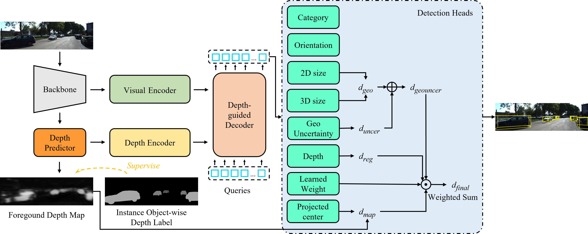

# InsMonoDETR: Instance-assisted Depth-guided Transformer for Monocular 3D Object Detection
Official implementation of "InsMonoDETR: Instance-assisted Depth-guided Transformer for Monocular 3D Object Detection".


## Introduction
Monocular 3D object detection is emerging as a promising alternative to conventional 3D object detection methods, such as those using LiDAR or stereo cameras, due to its compactness and low cost, enabling the determination of an object's 3D position from a single image. Depth estimation is a crucial yet challenging aspect of monocular 3D object detection, primarily because of the complexities involved in mapping 2D to 3D. Most current DETR-based methods leverage both visual and depth representations within a global context. This is possible thanks to transformers' properties, which enhance their prediction capabilities to state-of-the-art levels. Additionally, these models maintain competitive prediction speeds by eliminating the complex manual configurations of traditional 2D detectors, such as non-maximum suppression (NMS) and anchor generation. However, while these methods combine multiple-depth predictions to address the limitations of single-depth information, they typically average the predictions, which makes determining the overall accuracy of the combined depth difficult. To address this issue, this work proposes two innovative designs to enhance the complementarity of depth information. First, we improve the quality of depth using the Foreground Depth Map in MonoDETR, guided by Instance Object-wise Depth Labels (IODL). Second, we introduce an efficient method for combining depth components, allowing the final depth prediction to benefit flexibly from each component's contribution. Experiments on the public KITTI benchmark show that the proposed method achieves state-of-the-art performance without the need for additional data.
<div align="center">
  
</div>


## Installation
### InsMonoDETR
1. Clone this project and create a conda environment:
    ```
    git clone https://github.com/cmono3d/InsMonoDETR.git
    cd InsMonoDETR

    conda create -n insmonodetr python=3.8
    conda activate insmonodetr
    ```
    
2. Install pytorch and torchvision matching your CUDA version:
    ```bash
    python -m pip install torch==1.13.0+cu116 torchvision==0.14.0+cu116 torchaudio==0.13.0 --extra-index-url https://download.pytorch.org/whl/cu116
    # We adopt torch 1.13.0+cu116
    ```
    
3. Install requirements and compile the deformable attention:
    ```
    pip install -r requirements.txt

    cd lib/models/monodetr/ops/
    bash make.sh
    
    cd ../../../..
    ```
    
4. Make dictionary for saving training losses:
    ```
    mkdir logs
    ```
 
5. Download [KITTI](http://www.cvlibs.net/datasets/kitti/eval_object.php?obj_benchmark=3d) datasets and prepare the directory structure as:
    ```
    │MonoDETR/
    ├──...
    ├──data/KITTIDataset/
    │   ├──ImageSets/
    │   ├──training/
    │   ├──testing/
    ├──...
    ```
    Down load ImageSets files from here
    https://github.com/sshaoshuai/PointRCNN/tree/master/data/KITTI/ImageSets/data/KITTI/ImageSets 
    
    You can also change the data path at "dataset/root_dir" in `configs/monodetr.yaml` and "root_dir" (line 89) in `tools/mask_creator.py`.
### SAM

    pip install git+https://github.com/facebookresearch/segment-anything.git

## Get Started

### Create pseudo instance mask by SAM
    
    python tools/mask_creator.py
    
### Train
You can modify the settings of models and training in `configs/insmonodetr.yaml` and indicate the GPU in `train.sh`:

    bash train.sh configs/insmonodetr.yaml > logs/insmonodetr.log
   
### Test
The best checkpoint will be evaluated as default. You can change it at "tester/checkpoint" in `configs/insmonodetr.yaml`:

    bash test.sh configs/insmonodetr.yaml


## Acknowlegment
This repo benefits from the excellent [MonoDETR](https://github.com/ZrrSkywalker/MonoDETR.git).

<!-- ## Citation
```
to be updated
``` -->

<!-- ## Contact
If you have any questions about this project, please feel free to contact zhangrenrui@pjlab.org.cn. -->
